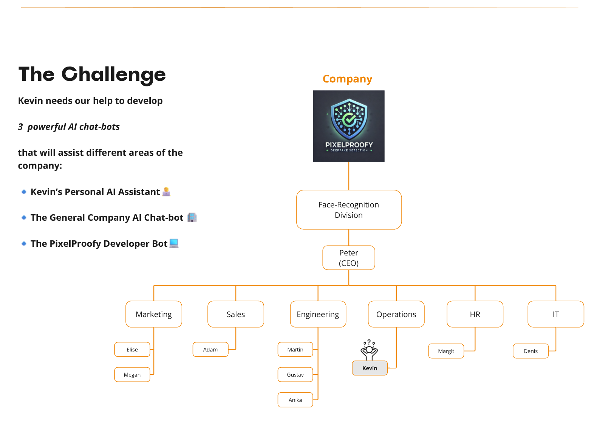
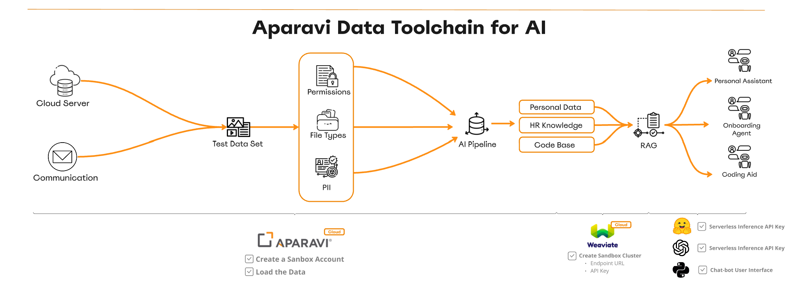

# 🚀 PixelProofy AI Chatbot Challenge


## 📢 Welcome to the PixelProofy AI Chatbot Challenge!
PixelProofy, a cutting-edge company specializing in **deepfake detection and face recognition AI**, needs your help! Their **Operations Lead, Kevin**, has been tasked with **building an enterprise chatbot ecosystem** to streamline workflows using **Generative AI**.

Kevin **needs your help** to develop **three powerful AI chatbots**:

1. **Kevin’s Personal AI Assistant** 🧑‍💻  
2. **The General Company AI Chatbot** 📖  
3. **The PixelProofy Developer Bot** 💻  

Your mission is to **design, build, and deploy these AI-powered assistants** using **Aparavi's AI Data Toolchain**.

---

## 🏢 Company AI Workflow
PixelProofy’s **AI chatbot ecosystem** is powered by **Aparavi's AI Data Toolchain** and **Weaviate vector search**.



### 🔗 Data Processing Pipeline
✔ **Data Sources**: Cloud Servers, Communication Logs  
✔ **Processing**: AI Pipelines analyze **permissions, file types, and PII**  
✔ **Storage**: **Weaviate vector DB** & **RAG (Retrieval-Augmented Generation)**  
✔ **Chatbot Capabilities**: Personal Assistant, HR Onboarding Agent, Developer Bot  

Each chatbot will **leverage structured company data**, ensuring **secure and accurate** AI-driven decision-making.

---

## 📌 Challenge Objectives
Participants will **design and implement AI chatbots** that integrate with **PixelProofy's internal systems, documentation, and proprietary AI models**.

### 1️⃣ Kevin’s Personal AI Assistant (Productivity Bot)
Kevin is overwhelmed with **emails, meetings, and reports**. His assistant should:

✔ **Manage Emails & Schedule Meetings** 📧  
✔ **Access Kevin’s Employee & Performance Data** 📊  
✔ **Provide Work Updates & Prioritize Tasks** 🚀  
✔ **Ensure Data Security & Privacy** 🔐  

### 2️⃣ The General Company AI Chatbot (HR & Onboarding Bot)
This bot will **assist all employees** with:

✔ **Understanding Company Policies & Benefits** 📜  
✔ **Providing HR Guidance & Onboarding Help** 🏢  
✔ **Ensuring Secure Data Access** 🔒  

### 3️⃣ The PixelProofy Developer Bot (Coding Assistant)
PixelProofy’s engineers need **an AI-powered coding assistant** that can:

✔ **Understand Proprietary Source Code** 💻  
✔ **Assist in Debugging, Testing & Code Review** 🔧  
✔ **Improve Collaboration & Code Documentation** 🔄  

---

## 🛠️ Setup & Installation

### ☁️ Aparavi Cloud Sandbox or Local Installation
Ensure you have either an **Aparavi Cloud Sandbox** or a **local installation** set up. You can find instructions on how to set these up on our [YouTube channel](https://www.youtube.com/).

### 🔧 Prerequisites
Ensure you have **Python 3.8+** installed, along with the required dependencies.

### 📥 Install Dependencies
```sh
pip install -r requirements.txt
``` 

## ⚙️ Run the Chatbot Locally

```bash
python chat.py
```

## 📂 Configuration Files

- `config.json` → Stores Weaviate & Hugging Face API keys. See [Hugging Face Setup](./docs/huggingface_setup.md) and [Weaviate Setup](./docs/weaviate_setup.md) for more details.
- `llm_settings.json` → Manages LLM settings (GPT, prompts, temperature, tokens). See [OpenAI Setup](./docs/openai_setup.md) for more details.

## 🛠️ LLM Prompt Engineering

PixelProofy’s AI assistant uses prompt engineering to generate high-quality responses. You can configure LLM settings in `llm_settings.json`.

### 🔹 System Prompt

```json
"system_prompt": "You are PixelProofy’s AI assistant, specializing in answering enterprise-related questions using the most relevant retrieved context. Your goal is to provide precise, well-structured, and professional responses based on the available context. If the provided context is insufficient, acknowledge it and avoid making assumptions."
```

### 🔹 User Prompt

```json
"user_prompt": "You are answering as PixelProofy's AI Assistant. Use the retrieved context to generate an accurate response. If the context does not contain relevant information, state that explicitly rather than making assumptions.\n\nContext:\n{context}\n\nUser Question:\n{message}\n\nChat History:\n{history}\n\n---\nEnsure responses are concise yet informative, maintaining a professional tone."
```

### 🔹 Key LLM Configurations

Located in `llm_settings.json`:

```json
{
  "openai_model": "gpt-4o",
  "temperature": 0.7,
  "max_tokens": 1000
}
```

## 🛠️ API Key Management

API keys for Weaviate & OpenAI are securely stored in:

1. `config.json` (Weaviate & Hugging Face Keys). See [Hugging Face Setup](./docs/huggingface_setup.md) and [Weaviate Setup](./docs/weaviate_setup.md) for more details.

```json
{
  "huggingface_api_key": "your-huggingface-api-key",
  "weaviate_url": "your-weaviate-instance-url",
  "weaviate_api_key": "your-weaviate-api-key",
  "embedding_model": "sentence-transformers/all-MiniLM-L6-v2"
}
```

2. `llm_settings.json` (OpenAI GPT Settings). See [OpenAI Setup](./docs/openai_setup.md) for more details.

```json
{
  "openai_api_key": "your-openai-api-key",
  "openai_model": "gpt-4o"
}
```

### 🔒 Security Tip:

- Store keys as environment variables instead of committing them to GitHub.
- Use `.env` files with `python-dotenv`.